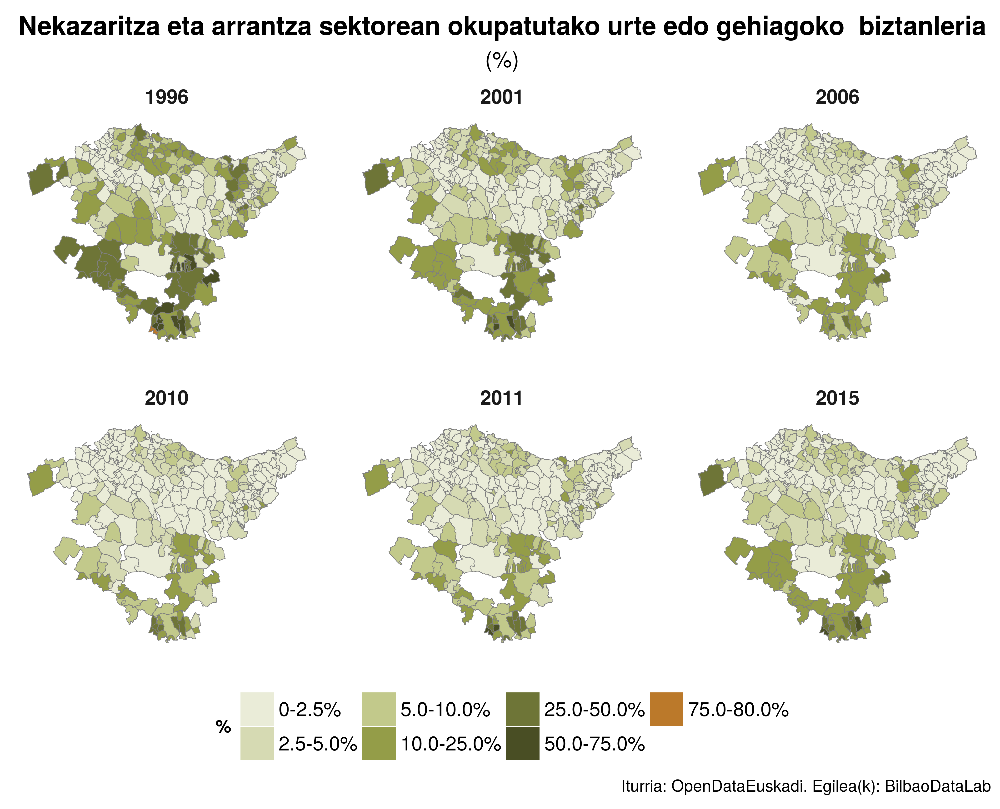
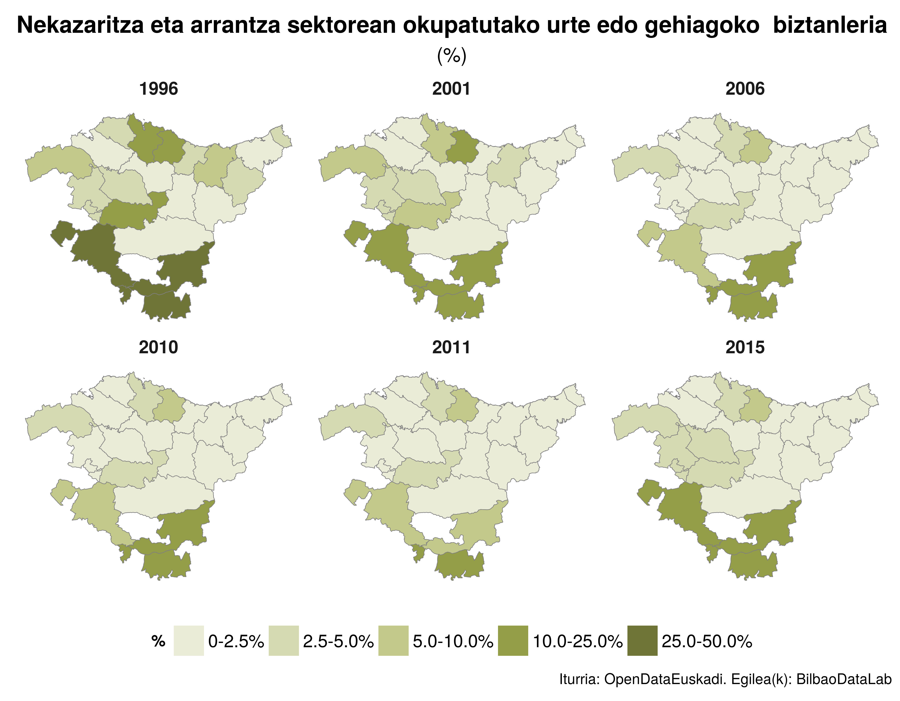

Udalmap-r-maps
=============

Biltegi honetan R erabiliz Udalmapetik adierazleak jaitsi eta irudikatzeko pausuak aurkituko dituzu.

In this repository you will find the steps to download and visualize the indicators from Udalmap using R.

Este repositorio incluye los pasos para descargar y visualizar los indicadores de udalmap utilizando R.

___

| Resource | Source | Description |
| --- | --- | --- |
| Data | [Udalmap](http://www.eustat.euskadi.eus/t35-udalmap/en/contenidos/informacion/udalmap/en_udalmap/udalmap.html) | Udalmap is an Municipal information system. The purpose of Udalmap is to know with detail the reality in the municipalities of the Autonomous Comunity of the Basque Country. |
| Maps | [Gaindegia](http://www.euskalgeo.net) | Gaindegia is an observatory dedicated to promoting knowledge and opinion on Euskal Herria's economy and society among its economic and social agents. |

Here you will find the **R** script to download and visualize all the indicators from **Udalmap** (now in OpenDataEuskadi). The indicators **data** can be found in the *data* directory. However, a shapefile provided by **Euskalgeo** has been used as a base layer for the map. The **ggplot** package has been used to complete the visualization.

This repository has been developed and/or used in the [4th session](http://bilbaodatalab.wikitoki.org/2016/12/05/puesta-en-marcha-en-r-y-mapas-con-datos-de-udalmap/ "4th session") and [5th session](http://bilbaodatalab.wikitoki.org/2017/01/10/workflow-de-un-proyecto-de-datos/ "5th session") organised by [BilbaoDataLab](http://bilbaodatalab.wikitoki.org "BilbaoDataLab").

How to use it
--------------

### Dependencies

There are some package depencies that must be solved:
```
> install.packages(c("rgdal", "dplyr", "tidyr", "scales", "stringi","stringr","ggplot2","ggthemes"))
```

### Running the script

The script to create the images can be run line-by-line from a IDE (i.e, rstudio). Also, it can be executed from command line as follows:
```
$ cd src
$ Rscript udalmap-udalerrika.R
$ Rscript udalmap-eskuladeka.R
```


Output Examples
--------------

After executing the scripts, the output images are placed in the *out* directory. There are two examples below:

  - Data grouped by town
<p align="center">
  
</p>

  - Data grouped by region
<p align="center">
  
</p>

Directory Layout
----------------

__Simplified directory layout:__

```
ROOT                            Root directory
├── LICENSE                     License details
├── README.md                   This file
├── data
│    ├── adierazleak.csv        Indicator details
│    ├── eskualdeka             Data for regions analitics
│    │   └── ...
│    ├── herrildeka             Data for provinces analitics
│    │   └── ...
│    ├── shp                    Maps and shp files
│    │   └── ...
│    └── udalerrika             Data for town analitics
│        └── ...
├── doc
│    ├── aldagaiak-udalmap.pdf  Indicator details in basque
│    ├── presentations
│    │   └── ...                Material used in presentations
│    └── varialbles-udamap.pdf  Indicator details in spanish
├── out
│    └── ...                    Output examples
└── src
     ├── udalmap-eskualdeka.R   Script to create plots by regions
     └── udalmap-udalerrika.R   Script to create plots by towns
```
